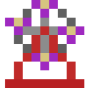
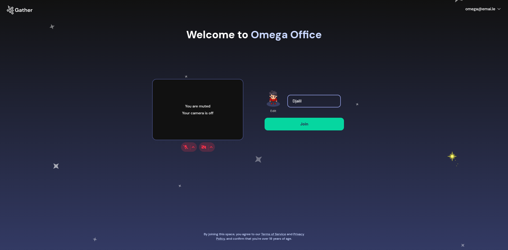
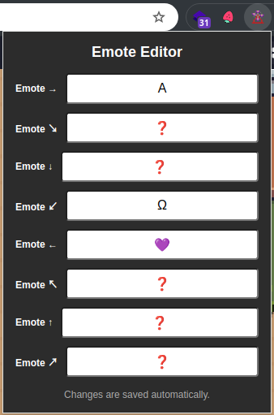
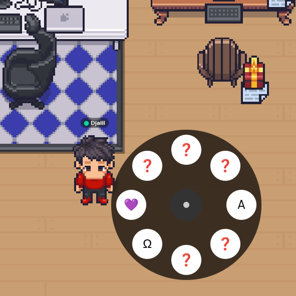

# Gather Town: Emote Wheel

  
  
Emote wheel for Gather.Town.

**Usage:**
- Press <kbd>Control</kbd> and mouse left-click to show the emote wheel.

**Disclaimer**:
The implementation is somewhat hacky, especially regarding Chrome Extension-related aspects, like how different parts (the action popup, content scripts, or whatever) interact with each other. \
Still, it's good enough for a weekend project.

## Features / Screenshots

Tested with:
- Google Chrome 134.
- Gather Town on 2025-03-28 (version unknown, HTTP/WS API V2?)

### Emote wheel

Notice that at the end of the video, the emote "Omega" is cleared after about 3 seconds, mimicking Gather's default behavior.

[emote-demo--2025-03-28.webm](https://github.com/user-attachments/assets/41a5a803-af14-4f30-8fdd-64e2c4741b99)  

Also, notice that there is no emote wheel here. It only appears if the user is actually in-game, as opposed to the welcome screen, for example.

  

### Emote editor

Notice that each input indicates the direction/position of the emote in the wheel.
Not the best UI/UX, but it's better than nothing.

**Some emotes/emoji/symbols to try:**
- 🎡
- 🫡
- Ω
- ⬢

| Edit via the extension popup                  | Result |
|-------------------------|------------|
|  |   |

## Installation

### Manual Installation (Developer Mode)

1. Download or clone this repository.
2. Open Chrome and navigate to `chrome://extensions/`.
3. Enable "Developer mode" in the top-right corner.
4. Click "Load unpacked" and select the extension directory.
5. The extension should now be installed and active.

## Background

The way it works is _not unlike_ Super Scoreboard (https://github.com/djalilhebal/super-scoreboard)--an overlay "superimposed" over another game.

I considered using [`pointer-events: none`](https://developer.mozilla.org/en-US/docs/Web/CSS/pointer-events) to achieve a similar effect, but `display: none` was enough.

Initially, I planned to create the emote wheel using Java with the libGDX libraries [PieMenu](https://github.com/payne911/PieMenu) and [Vis UI](https://github.com/kotcrab/vis-ui). However, I went with a simpler implementation: vanilla JavaScript. \
V0 and Claude assisting in the development of the circular menu.

After inspecting/debugging Gather, I found a convenient global object `game` with an even more convenient method `setEmote`. \
The gotcha was that `setEmote` does not unset it automatically after some delay, so I had to re-implement that logic.

### Inspiration

- League's emote wheel
  * Example: [RIOT FINALLY CHANGED THE EMOTE WHEEL - League of Legends - YouTube](https://www.youtube.com/watch?v=nc2P9n4-7xY)

## Uses

- [ ] LibGDX

  * [ ] [PieMenu](https://github.com/payne911/PieMenu)

    + [Web demo](https://payne911.github.io/PieMenu/)

  * [ ] [Vis UI](https://github.com/kotcrab/vis-ui)

    + [Web demo](https://vis.kotcrab.com/demo/ui/)

## Resources and further reading

- https://symbl.cc/

- https://emojipedia.org/

Counting emoji is not easy:

- [Jonathan New | "💩".length === 2](https://blog.jonnew.com/posts/poo-dot-length-equals-two)

- [How to count the correct length of a string with emojis in JavaScript](https://stackoverflow.com/questions/54369513/how-to-count-the-correct-length-of-a-string-with-emojis-in-javascript)

## Credits

- The icon is actually [SerenityOS' Ferris Wheel emoji](https://emojipedia.org/serenityos/2024-01-31/ferris-wheel).

- The icon was upscaled using [Pixel Art Scaler](https://lospec.com/pixel-art-scaler/).

- The icon variations were generated using [Chrome Extension Icon Generator](https://github.com/alexleybourne/chrome-extension-icon-generator).

## License

WTFPL
